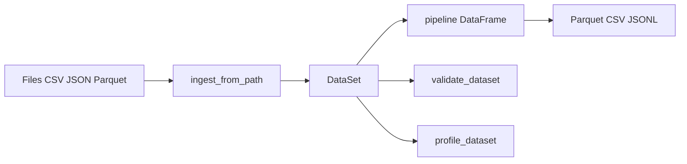

# Documentation builds and hosting

End-user readable API documentation is produced as **Rust** via **rustdoc** (`cargo doc`), **Python** via **pdoc**, and **Java** as **Markdown → HTML** (`docs/java/EXAMPLES.md` via Pandoc). CI assembles all of these into a single static site deployed to **GitHub Pages** on pushes to `main`.

## Published URLs

| Audience | What | URL |
| --- | --- | --- |
| Rust (released crate) | docs.rs for the version published on crates.io | [docs.rs/rust-data-processing](https://docs.rs/rust-data-processing) |
| Rust + Python (main branch) | Combined site from CI (requires Pages setup below) | `https://<owner>.github.io/<repo>/` — for this repo: [rust-data-processing GitHub Pages](https://rust-data-processing.github.io/rust-data-processing/) |
| Rust (main branch, rustdoc on Pages) | Crate API HTML | […/rust/rust_data_processing/index.html](https://rust-data-processing.github.io/rust-data-processing/rust/rust_data_processing/index.html) |
| Python (main branch, pdoc on Pages) | Top-level module | […/python/rust_data_processing.html](https://rust-data-processing.github.io/rust-data-processing/python/rust_data_processing.html) |
| Java (main branch, Pandoc on Pages) | Examples tour (JVM bindings) | […/java/examples.html](https://rust-data-processing.github.io/rust-data-processing/java/examples.html) (source: [`docs/java/EXAMPLES.md`](java/EXAMPLES.md)) |
| Back-compat | Bare `/rust_data_processing.html` at site root | Redirects to the Python module page above (same as […/rust_data_processing.html](https://rust-data-processing.github.io/rust-data-processing/rust_data_processing.html)) |

Until the first successful **crates.io** publish, docs.rs may be empty; use the **GitHub Pages** link for the latest **main** rustdoc.

## CI workflow

- Workflow file: [`.github/workflows/docs.yml`](../.github/workflows/docs.yml).
- **On every pull request:** builds rustdoc and Python pdoc; does **not** deploy.
- **On push to `main`:** builds the same artifacts and **deploys** to GitHub Pages using the official `actions/deploy-pages` flow.

Rust steps: `cargo doc --no-deps --locked` → output copied to `site/rust/`.

Python steps (in `python-wrapper/`): `uv sync --group dev`, `maturin develop --release`, then `pdoc -d google -o …/site/python rust_data_processing`.

Java examples page: CI installs **Pandoc**, runs `pandoc docs/java/EXAMPLES.md -o site/java/examples.html` (see `.github/workflows/docs.yml`) with a small header stylesheet under `docs/landing/java-examples-pandoc-header.html`.

**Images:** Markdown included via `rust_data_processing.examples` lives in [`docs/python/README.md`](python/README.md) and may reference [`docs/images/`](images/) (for example the Phase 1 scope infographic). After pdoc runs, CI copies `docs/images/` into `site/python/images/` and `site/images/` so `../images/...` links work for both `python/examples.html` and `python/rust_data_processing/examples.html`.

The landing page is committed at [`landing/index.html`](landing/index.html) and copied to `site/index.html` during the assemble step.

## One-time GitHub Pages setup (maintainers)

1. Repo **Settings → Pages**.
2. Under **Build and deployment**, set **Source** to **GitHub Actions** (not “Deploy from a branch”).
3. Merge a workflow that deploys via `actions/deploy-pages` (already present in `docs.yml`). The first successful run on `main` publishes the site.

If Pages is not configured, the **Documentation** workflow should still go green for **build** jobs; **deploy** will fail until Settings are updated.

## Local builds

### Rust only (Windows / PowerShell)

```powershell
./scripts/build_docs.ps1
```

Output: `target/doc/` — open `target/doc/rust_data_processing/index.html`.

### Rust + Python site (mirror of CI)

```powershell
./scripts/build_docs.ps1 -All
```

Then:

- Rust: `target/doc/rust_data_processing/index.html`
- Python: `_site/python/index.html` (under repo root, created by the script)
- Java: `_site/java/examples.html` when **Pandoc** is on `PATH` (otherwise the script prints a skip warning)

### Manual Python pdoc (from `python-wrapper/`)

```bash
uv sync --group dev
uv run maturin develop --release
uv run pdoc -d google -o ../_site/python rust_data_processing
```

## Phase 3 (Panama JVM + Maven + Gradle + Kafka surfaces)

Phase **3 GA** mandates **Panama**, **Maven**, **Gradle**, **Kafka** on Rust/Python/JVM (including BYO connectors), and **Rust↔JVM API parity** (same capabilities as the Rust crate unless documentedly impossible). **`Planning/PHASE3_EPICS.md`** owns the Phase 3 checklist (single tracker).

Scaffold (**`bindings/`**, Maven + Gradle; parity tracker **`Planning/PHASE3_EPICS.md`**) runs **`mvn verify`**, **`./gradlew check`**, **`publishToMavenLocal`** on **Linux / Windows / macOS** × JDK **21** — **`.github/workflows/jvm_bindings_ci.yml`** (plus **`scripts/check_jvm_ffi_manifest.py`**).

**Maven Central onboarding (tokens / cost):** **[`docs/java/MAVEN_CENTRAL_PUBLISHING.md`](java/MAVEN_CENTRAL_PUBLISHING.md)**.

**Increment 1 (spike concluded)** — proving **`cdylib`**, **`rdp_ffi.h`**, and FFM linkage only: **[`docs/adr/003-jvm-panama-ffi-spike.md`](adr/003-jvm-panama-ffi-spike.md)**, **`spikes/jvm-panama-ffi/README.md`**. Quick compile check: **`cargo test --manifest-path spikes/jvm-panama-ffi/Cargo.toml`**. That directory is **not** the Phase **3 GA** Maven/Gradle product tree.

## Issue triage and reporting

See [ISSUE_TRIAGE.md](ISSUE_TRIAGE.md) and root [README.md § Reporting bugs](../README.md#reporting-bugs).

## Architecture sample (Mermaid)

Default diagram style for this repo: **Mermaid** (renders on GitHub). Example high-level flow:


