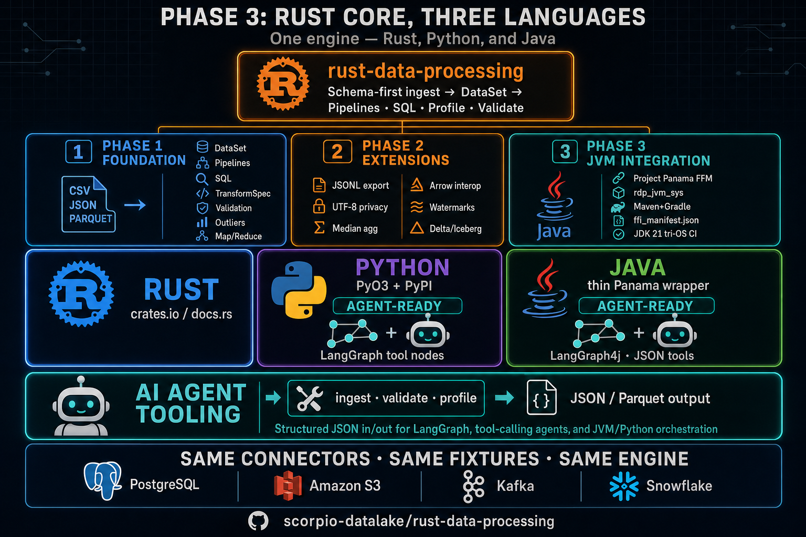

# JVM bindings (Phase 3)

**Maven** and **Gradle** are **blocking** Phase 3 deliverables (see **`Planning/PHASE3_EPICS.md`**).

*Infographic: Phase 3 — one Rust engine; Java thin Panama wrapper (`rdp_jvm_sys`, Maven + Gradle) alongside Python (PyO3); JSON parity FFI for agents; same connectors and fixtures as Rust/Python.*

| Resource | Purpose |

| --- | --- |

| **`Planning/PHASE3_EPICS.md`** | Phase 3 epic tracker — **Rust ↔ JVM parity rows** live there only |

| **[FFI_API_SLICE.md](FFI_API_SLICE.md)** | Rust-only vs FFI-projected surface |

| **[EXAMPLES.md](EXAMPLES.md)** | **Java examples tour** (Panama, parity exports, watermarks / partition discovery, **[Rust-first ETL vs JVM](EXAMPLES.md#rust-first-etl-vs-jvm-consumption)** for all `dataset` outputs, links to Python `examples.html`) — published on Pages as **`java/examples.html`** |
| **[FFI_MANIFEST_JAVA_USAGE.md](FFI_MANIFEST_JAVA_USAGE.md)** | **`ffi_manifest.json`**, Maven, native lib, **`RdpNativeJson`**, production FFI (**§9**), **`java -cp`** examples, **§7 large-result guidance** (files / Rust-side ETL) |

| **[ARROW_FFI_JVM.md](ARROW_FFI_JVM.md)** | Arrow IPC milestone (**S1d**) |

| **[NATIVE_ARTIFACT_PACKAGING.md](NATIVE_ARTIFACT_PACKAGING.md)** | Classifier JARs / **`META-INF/native`** (**S1e**) |

| **[gradle.md](gradle.md)** | Gradle consumer deps (classifiers) + maintainer test path |

| **[JEXTRACT.md](JEXTRACT.md)** | Regenerate Panama stubs from **`rdp_jvm_sys.h`** |

| **[RELEASE.md](RELEASE.md)** | Version alignment + Maven Central |

| **[MAVEN_CENTRAL_PUBLISHING.md](MAVEN_CENTRAL_PUBLISHING.md)** | Portal account + **user tokens** |

| **[SONATYPE_NAMESPACE_CHECKLIST.md](SONATYPE_NAMESPACE_CHECKLIST.md)** | Namespace proof (**S2a**) |

| **[JIRA_INTEGRATION.md](JIRA_INTEGRATION.md)** | Maintainership visibility (**S5a–c**) |

| **ADR [005](../adr/005-jvm-panama-production-policy.md)** | Panama baseline, semver, Maven∧Gradle (**S0a**) |

## Repo layout

| Path | Contents |

| --- | --- |

| **`bindings/jvm-sys/`** | Rust **`cdylib`** (`--features jvm_ffi` aliases **`link-main`**), **`ffi_manifest.json`**, **`include/rdp_jvm_sys.h`** |

| **`bindings/java/VERSION`** | Single SemVer line — **`pom.xml`** / **`gradle.properties`** must match (**CI enforced**) |

| **`bindings/java/rdp-jvm-sys/`** | Maven metadata POM for native classifier JARs (`META-INF/native/…`) |

| **`bindings/java/rust-data-processing-jvm/`** | **`pom.xml`**, Gradle **`maven-publish`**, tests (**`FfiExportedSymbolsContractTest`**, **`DocsExampleNativeIntegrationTest`**, **`JvmNativeContractScenarios`**, **`PytestMirrorAssertions`**, **`ParityMatrixDeferredExportTest`**, **`RdpJvmSysTestSupport`**) |

| **`bindings/java/rust-data-processing-jvm-examples/`** | Runnable demos + **`ExamplesMirrorSmokeTest`** — pytest-scenario mirrors only (publish/run separately from Python **`examples/`** or Rust doc examples) |

## CI caching (**P3-E1-S4b**)

**`.github/workflows/jvm_bindings_ci.yml`** restores **`~/.m2/repository`** and **`~/.gradle/{caches,wrapper}`** via **`actions/cache`** keyed on POM / Gradle files. It sets **`JAVA_TOOL_OPTIONS=--enable-preview --enable-native-access=ALL-UNNAMED`**, runs **`mvn verify`** (Surefire + **JMH** at **`integration-test`**), then **`./gradlew jar check`** and **`./gradlew jmh`** on Linux / Windows / macOS. Progress is tracked only in **`Planning/PHASE3_EPICS.md`**.

